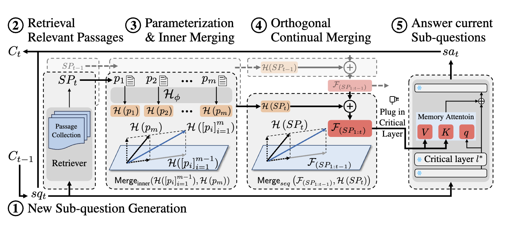
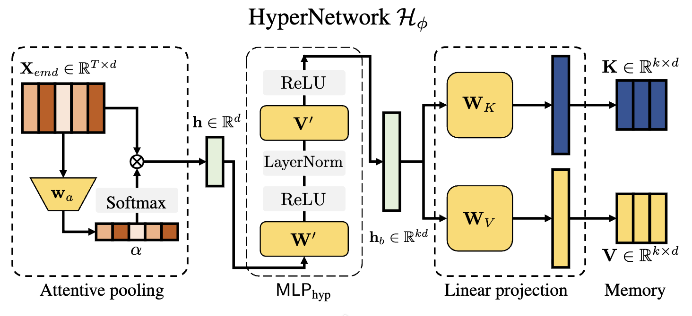
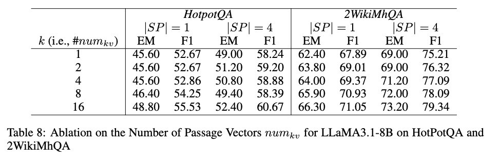

# MergePRAG (PyTorch)
> A from scratch PyTorch implementation of the Transformer based on
the MergePRAG framework proposed in a paper by the UNIST NLP Lab.

> This repository aims to reproduce and explore the core ideas and architecture
presented in the original research.

<br>
<p align="left">
  
</p>
<p align="left">
</p>
<em>Figure : Overview of MergePRAG for multi hop QA.</em>

## Paper Reference

This implementation is based on the following paper authored by the **UNIST NLP Lab**:

> **MergePRAG: Orthogonal Merging of Passage experts for Multi-hop Parametric RAG**  
> *Submitted to the International Conference on Learning Representations (ICLR) 2026*

paper : https://openreview.net/forum?id=FSL1J2gmJV
<br>

<br>

# STEP 1. Preparation dataset 
> Unlike the original paper, the base LLM used here is a basic Transformer implemented from scratch, following the architecture proposed in “Attention Is All You Need.”

```py
# 모델의 모든 파라미터 고정하기. (크리티컬 레이어 찾기위해서.)
def freeze_model(model:nn.Module):
  for p in model.parameters():
    p.requires_grad=False
  return model

# MoE, hypernetwork 등 추가할때 requires_grad=true 해주셈

```
```py
# required_grad=true인 애들만 역전파 해줘야함. 따라서 "optimize" 함수정의
# 즉 MoE,H() 를 진행할때 required_grad=true 해주고 켜준애들만 역전파 
def optimize(model:nn.Module):
  trainable_params=[p for p in model.paramerters() if p.requires_grad]
  optimizer=torch.optim.AdamW(trainable_params,lr=1e-4,weight_decay=0.01)
```
> 이제 Injection 해야함. 즉 내가 구현했던 Transformer에 FeedFoward에 injection 해야함.

> Inject 하려면 일단 Hypernetwork 만들어야하고, 그 전에 retrieverd data도 준비해야하고, Reasoning chain도 해놔야함. 즉 전처리된 dataset과 HyperNetwork 가 있어야함

> 일단 dataset 부터 준비 ㄱㄱ

```py
from datasets import load_dataset
data=load_dataset("hotpotqa/hotpot_qa", "fullwiki")
train=data["train"]
vaild=data["validation"]
```
> 이제 SPt를 만들어서 HyperNetwork에 넘겨줘야한다. 즉 SPt를 만들어줘야한다.

> 데이터셋의 supporting_facts, context를 활용하여 만들어준다.

> 만들어진 passage를 retrieved passage로 간주한다.

> 이때 "hotpotqa/hotpot_qa" 데이터셋 구조는 이와같다. <br>
> answer,fact,context,sentence. 여기서 SPt를 만들어줘야한다. 따락서 fact에서 answer의 근거가 되는 문장위치 찾고 context에서 문서이름 찾고, sentence에서 해당문서의 문장을 찾아서 가져온게 SPt중 하나가 되는것.
```py
# SPt 만들어주기.
def make_SPT(data):
  context_title=data["context"]["title"]
  context_sentence=data["context"]["sentence"]

  sub_title=data["supporting_facts"]['title']
  sub_ids=data["supporting_facts"]["sent_id"]

  facts=[]

  for t,sid in zip(sub_title,sub_ids): #fact에서 제시한 문서이름,몇번째 문장을 페어로 순회
    if t in context_title: # 만약 문서가 context에 있으면 트루
      idx=context_title.index(t) # 인덱스 구하고
      sentence=context_sentence[idx] # 해당 인덱스에 sentence 전체문장 다 가져옴

      if 0<=sid<len(sentence): # 만약 sid가 범위 만족하면 
        passage=sentence[sid].strip() # 전체 sentence중 sid에 해당하는 문장 가져옴
        facts.append(passage) # passage 넣어줌. 이게 쌓이면 SPt가 됨
  return facts
```
<br>

```py
new_train=[]

for k in train: # make_SPT 적용
  passage=make_SPT(k)

  new_train.append({ # 질문,답,fact 구조
      "question":train['question'],
      "answer":train['answer'],
      "facts":passage
  })

new_valid=[]

for k in valid:
  passage=make_SPT(k)

  new_valid.append({
      "question":valid['question'],
      "answer":valid['answer'],
      "facts":passage
  })

#train,valid 둘다 적용

```
> 이제 Reasoning Chain을 해줘야함. <br>
> 여기서 Decomposition 개념이 들어감. 즉 분리 <br>
> 논문 코드에서는 Decomposer 모델을 학습을 시켜서 sub question, sub answer를 만들고있음. <br>

> Decomposer 모델의 역할과 ai api의 역할이 비슷하다고 봄. 논문 특성상 외부 api를 아키텍처에 포함시키지 못하기 때문에 별도의 로컬 모델링을 했다고 생각함. 구현편의상 나는 api를 바로 사용할 계획

> 논문 코드에서는 chain, 즉 시계열적 순서도 llm을 통한 학습으로 진행된다. 따라서 하위질문,하위답변, 시계열적 논리순서 모두 llm을 사용하여 새로운 데이터셋을 만들어야한다.

> llm을 활용하여 논리순서, 하위질문, 하위답변을 포함한 재설계된 데이터셋 구축 진행.

##### find critical layer 
> 현재 critical layer를 찾으려면 inject 해보면서 변화들을 관찰할 필요가 있는데

> 그럴려면 hypernetwork를 먼저 만들어줘야 가능함.

##### HyperNetwork 

<br>
<p align="left">
  
</p>
<p align="left">
</p>

<em>Figure : Overview of HyperNetwork Architecture.</em> 

<br>

> 데이터셋에 들어있는 passage들을 memory Key,Value로 변환해주는 네트워크임.

> 즉 미리 구현했던 transformer의 encoder를 활용하여 passage를 임베딩하는 작업 필요.

> in paper, "... from an auxiliary Transformer encoder", 이때 auxiliary 라는 단어때문에, <br> encoder와 inject into critical layer의 대상인 모델은 별도의 모델이라는것을 유추해볼수 있음.

> 이번 구현에서는 reasoning chain passage를 encoding하는 모델과 critical layer에 inject하는 모델은 서로 분리되어야함.

>  따라서 2개의 transformer를 설정하고 시작해야함.

```py
def passage_embedding(data):

  loader = DataLoader(data, batch_size=125, shuffle=True, collate_fn=collate_facts)

  attention=Attention(64,64,512)
  ffw=FeedForward(512,1024)
  embedding_facts=TokenEmbedding(tokenizer.vocab_size,512) #token

  for batch in loader:
    input_ids=batch["input_ids"]
    attention_mask=batch["attention_mask"]
    #print(input_ids)
    encoding_facts=embedding_facts.embedding(input_ids) #embedding in encoding
    encoding_facts=embedding_facts.positional_encoding(encoding_facts) #token,embedding,positional in encoding

    #------------------ encoder --------------------
    for _ in range(6): #6번 반복 nx=6

      #multi-head self attention in encoding 실행
      x=attention.forward(encoding_facts,encoding_facts,encoding_facts)

      encoding_facts=ffw.forward(x) #encoding end

  return encoding_facts

```
> 기존 Transformer encoder의 class 그대로 사용하여 passage를 embedding해줌.


# STEP 2. HyperNetwork

> 현재 shape => (B,T,d_model). 하지만 이걸 (B,d_model)로 바꿔줘야함.

> fact 하나당 하나의 d_model 임베딩벡터를 할당해줘야한다. 즉 (B,d_model) 로

> 이부분이 약간 헷갈리는데, 만약 fact가 5개의 token을 가지고있다고 가정하면,
- h₁ ∈ ℝ⁵¹²
- h₂ ∈ ℝ⁵¹²
- h₃ ∈ ℝ⁵¹²
- h₄ ∈ ℝ⁵¹²
- h₅ ∈ ℝ⁵¹²
> 이렇게 나열해볼수 있고, 이때 이 5개의 임베딩된 토큰을 하나의 임베딩벡터로 "polling" 해주게 되면 하나의 fact의 하나의 임베딩벡터가 할당된다.

### Attentive pooling

> 과정을 순서대로 써내려가보자면,

> 1. transformer encoder를 통과한 벡터를 H라 하면, H ∈ ℝ^(B * T * d_model)

> 2. 각 토큰에 대해 스칼라 attention score 계산.

> 3. 정규화
 
> 4. 가중합을 통해 embedding 생성.

> 5. 이렇게 나온 벡터 H는, H ∈ ℝ^(B * d_model) 이때 B=fact, d_model=512 (by transformer)

<br>
이제 진행해보자. 논문 아키텍처에서는 ℝ가 T*d 에서 d로 바뀌는걸로 표시되있는데, 이건 하나의 passage를 기준으로 나타낸것. 즉 facts를 모아둔 B라는 차원이 생략되있음. <br>
따라서 전체 passage를 포함하면 ℝ^(B*T*d_model)->ℝ^(B*d_model) 이 된다.
<br>

논문에서 나온 수식은 아래와 같다. <br>

X=Embedding(X), S=Wa * X 일때, Emd(p)=h=softmax(S​) * X​ 
<br>

```py
#S=WaX
import torch
import torch.nn as nn

class ScoreLayer(nn.Module):
  def __init__(self, d_model):
    super().__init__()
    self.Wa=nn.Linear(d_model,1) #토큰의 임베딩벡터 -> 1(스칼라)

  def forward(self,H,mask=None):
    #H:(B,T,d),
    score=self.Wa(H).squeeze(-1) #마지막차원 1 지워주기
    if mask is not None:
      # padding 토큰 무시하기. -무한 넣어주면 0이됨
      score=score.masked_fill(mask==0,float('-inf'))

    # dim=1: 가로
    alpha=torch.softmax(score,dim=1)

    # alpha의 차원 하나 늘려주기. H랑 연산하려고.
    pooled=torch.sum(alpha.unsqueeze(-1)*H,dim=1)

    return pooled
# 여기까지 h 차원=(B,d_model)
```
> 여기서 좀 머리아팠음.

> 자. 먼저 처음에 들어온 H를 그냥 가중합하는게 아니라 중요도 score를 측정해서 가중합 하는거임.

> 이떄 마지막 torch.sum을 할때 dim=1, 즉 토큰기준으로 합을 해줌으로써 차원은 T가 사라지고 B,d만 남게됨.

> 이게 무엇을 의미하는가, 에 대해서 생각해볼 필요가 있음.

> 즉 embedding 차원을 512로 설정했다면 512개의 축이 있는거고, 모든 토큰은 512개의 축을 사용하여 의미를 내포하고있음. 즉 같은 축끼리 계산을 해야 의미가 죽지 않는다고 생각함.

> 따라서 모든 토큰의 같은 인덱스를 가진 "embedding"끼리 더해줘야함. 같은 축끼리 계산해야하니까..!

> 따라서 선형변환을 통해 가중치가 반영된 벡터에서 같은축, 즉 같은 인덱스의 embedding값끼리 sum을 해줌으로써, 차원하나가 사라지는데, 그 차원이 토큰(T) 이 되는거임.

##### 고로 이러한 연산의 의미는 모든 토큰이 d차원의 embedding값을 사용해 내포하고있는 의미들을 다시한번 합쳐주는것. => 하나의 passage(fact) 를 나타내는 embedding 벡터를 생성했다는 의미가 나온다는것임

> 따라서 최종적으로 나오는 벡터 h의 차원은 B*d가 되는거임. 

### MLP
> 논문 내용에 따르면 수식은 아래와 같다. 

> hb = MLPhyp(h)​ = ReLU(V′ * LayerNorm(ReLU(W′h)))

> 선형 -> 비선형 가중치벡터로 바꿔주는 느낌

```py
class MLP(nn.Module):

  def __init__(self,d_model):
    super().__init__()
    self.W=nn.linear(d_model,d_model)
    self.V=nn.linear(d_model,d_model)
    self.ln=nn.LayerNorm(d_model)
    self.relu=nn.ReLU()


  def forward(self,h):
    # 논문수식을 그대로 적용. 이때 d_model은 512로 고정.
    # 선형변환도 d_model->d_model로 설정.
    res=self.relu(self.V(self.ln(self.relu(self.W(h)))))

    return res
```
> 이제 MLP에서 나온 벡터를 두개의 선형변환을 통해 서로다른 2개의 벡터를 만들어줘야한다. 이때 k상수를 곱해준다.

> 즉 injection할 K메모리와 V메모리를 k개 늘려줌으로써 성능향상을 도모한다. 이때 논문에서는 k=16일때 성능이 가장 좋게 나왔음을 보여주고 있다.

> 물론 환경이 다르지만 k=16으로 진행하였다.

<br>
<p align="left">
  
</p>
<p align="left">
</p>
<em>Table 8: Ablation on the Number of Passage Vectors numkv.</em>
<br>

> Linear Projection code 
```py
class LinearProjection(nn.Module):
  def __init__(self,d_model,k):
    super().__init__()
    self.K=nn.Linear(d_model,k*d_model)
    self.V=nn.Linear(d_model,k*d_model)

  def forward(self,h):
    res_k=self.K(h)
    res_v=self.V(h)

    return res_k,res_v
```
> Attentive Pooling, MLP, Linear Projection을 순서대로 묶어주면 HyperNetwork(H())가 된다

# STEP 3. Orthogonal Continual Merging Mechanism

> 이젠 hop 안에 많은 passage들을 메모리 K,V 벡터로 변환시켜줬기 때문에, 얘네들을 직교병합 해줘야함.

> 그러면 hop 하나당 K,V 각각 하나의 메모리벡터만 남게된다.

> 나아가서 새로운 hop이 들어오면 동일하게 진행한뒤 hop간의 직교병합을 또 함.

> hop간의 직교병합이 다 끝나면 inject 진행.

##### Orthogonal Merge

> 질문당 K,V 메모리를 얻을수 있고 K,V는 각각 여러 홉을 가지고있음.

>  hop간의 merge를 진행한 후 inject를 해야함.

> merge를 할대 orthogonal merge를 해줘야하는데 여기에 선형대수 개념이 들어감. 이부분을 공부할 필요가 있음.

---
##### 선형대수 개념

<p align="left">
  
</p>
<p align="left">
</p>
<em>10,11 수식</em>

---

> 선형대수 개념을 활용한 수식 10,11번을 사용하여 Orthogonal merge function 구현
```py
def orthogonal_merging(WF:torch.Tensor|None,Wt:torch.tensor,eps=1e-6)->torch.Tensor:
  if WF==None: # 만약 merge된 벡터 없다면 wt바로 반환
    return Wt
  
  # Wf:[d,k]
  # Wt:[d,k]

  # d차원에서 정사영 해줘야하므로 행이 d가 되야함. 즉 전치
  A=WF.T # 기존 memory
  B=Wt.T # 추가할 memory

  k=A.size(1)
  d=A.size(0)

  gram=A.T@A #[k*k]
  gram+=eps*torch.eye(k,device=gram.device)
  gram=torch.linarg.inv(gram)

  P=A@gram@A.T #10번수식 적용 [d,d]

  res=B-(torch.eye(d,device=P.device)-P)@B #직교 성분 가져오기.

  A+=res

  return A.T # 입력값 차원 그대로 다시 [k,d] 로 반환하기
```


```py
loader = DataLoader(train, batch_size=125, shuffle=True, collate_fn=collate_facts)
pooling=AttentivePooling(512) #attentive pooling
mlp=MLP(512) #mlp
linearprojection=LinearProjection(512,16) #Linear Projection

for batch in loader:
  input_ids=batch["input_ids"]
  attention_mask=batch["attention_mask"]
  facts_len=batch["facts_len"]

  data=passage_embedding(input_ids) #embedding
  data=pooling.forward(data,attention_mask) #pooling
  data=mlp.forward(data) #mlp
  data=linearprojection.forward(data)#linear projection
  data_K=data[0] #K memory 
  data_V=data[1] #Vmemory

  start=0
  for n_hop in facts_len:
    end=start+n_hop

    K=data_K[start:end]
    V=data_V[start:end]

    start=end

    # 각 질문마다의 passage를 H()를 거쳐 구해준다. 
    # 여기서 나오는 K,V를 쓰면 됨.
  
  break
```


 


... ing
